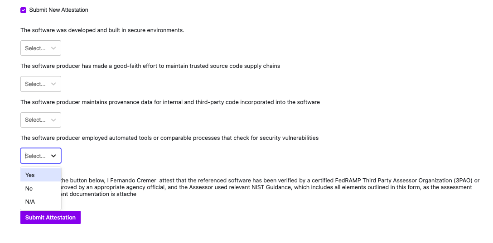

# Attestation

Provide a form for Service Owners to attest that their service is compliant and/or meets certain standards.

## Overview

The attestation plugin provides a starting point to provide end users with a form to attest to compliance related questions. The responses are saved as custom data, and thus available to score and report on via CQL. 

The plugin comes with three sample placeholders questions that need to be replaced with questions that are relevant to you. The sample questions are inspired by the [Secure Software Development Attestation Common From](https://www.cisa.gov/sites/default/files/2023-04/secure-software-self-attestation_common-form_508.pdf).

It is expected that you will need to make some moderate changes to this plugin to make it fit your use case.

## How it works

The plugin is meant to be used at the entity level and will not work if accessed otherwise. A service owner is able to use this plugin to attest that their service meets certain standards by answering `yes`, `no` or `n/a` to pre defined questions. Once they submit their answers, the plugin saves these answers along with the Attestee and date to the entity's custom data. This makes the reponses available to Scorecards, CQL Reports, etc...

The ability to submit a new attestation is limited to service owners. They way this is implemented in the plug-in is by comparing the `context.user.role` with the entity's OpenApi spec, specfically the value for `x-cortex-owners.name`.

### Plugin Sections

The plugin has three main sections: 

#### 1. Previous Attestation

The top of the screen will show you the previous attestation. 

In its out of the box state, the table displays the following information:

**Date** The date when the previous attestation was performed
**Signed By** The logged in user that performed the attestation

The remaining column map to the sample questions included out of the box

If no previous attestation has occurred a message is displayed.

#### 2. Submitting a new attestation

Check the "Submit new attestation" to display the attestation form. Keep in mind that at this time this option is available to anyone that can access the plugin.

#### 3. Submit Form

The form contains only three select controls, each with a `<Text/>` object that contains a question. Replace this with the questions that make sense for your use cases.

Once the form is successfully submitted it will display a message box

 The plugin saves the information as [custom data](https://docs.cortex.io/docs/reference/basics/custom-data) attached to the current entity.

 

 Since the data is saved as custom data, this means you can write rules for it in scorecards and query results using our Query Builder and CQL Reports.

## Example Scorecard

To help you get started with scorecards, we've included a sample scorecard that evaluate the questions that comes with the plugin. In this example, if the attestee answers `yes` to all questions, the service is considered `compliant`, otherwise it is considered `non-compliant`.

## Adding your own questions

The plugin comes with three select controls each with a placeholder Text control. Replace the contents with of the Text object with your own questions. Rename the variables and refactor as appropriate.

Attest is a [Cortex](https://www.cortex.io/) plugin. To see how to run the plugin inside of Cortex, see [our docs](https://docs.cortex.io/docs/plugins).

### Prerequisites

Developing and building this plugin requires either [yarn](https://classic.yarnpkg.com/lang/en/docs/install/) or [npm](https://docs.npmjs.com/downloading-and-installing-node-js-and-npm).

## Getting started

1. Run `yarn` or `npm install` to download all dependencies
2. Run `yarn build` or `npm run build` to compile the plugin code into `./dist/ui.html`
3. Upload `ui.html` into Cortex on a create or edit plugin page
4. Add or update the code and repeat steps 2-3 as necessary

### Notable scripts

The following commands come pre-configured in this repository. You can see all available commands in the `scripts` section of [package.json](./package.json). They can be run with npm via `npm run {script_name}` or with yarn via `yarn {script_name}`, depending on your package manager preference. For instance, the `build` command can be run with `npm run build` or `yarn build`.

- `build` - compiles the plugin. The compiled code root is `./src/index.tsx` (or as defined by [webpack.config.js](webpack.config.js)) and the output is generated into `dist/ui.html`.
- `test` - runs all tests defined in the repository using [jest](https://jestjs.io/)
- `lint` - runs lint and format checking on the repository using [prettier](https://prettier.io/) and [eslint](https://eslint.org/)
- `lintfix` - runs eslint in fix mode to fix any linting errors that can be fixed automatically
- `formatfix` - runs Prettier in fix mode to fix any formatting errors that can be fixed automatically

### Available React components

See available UI components via our [Storybook](https://cortexapps.github.io/plugin-core/).
