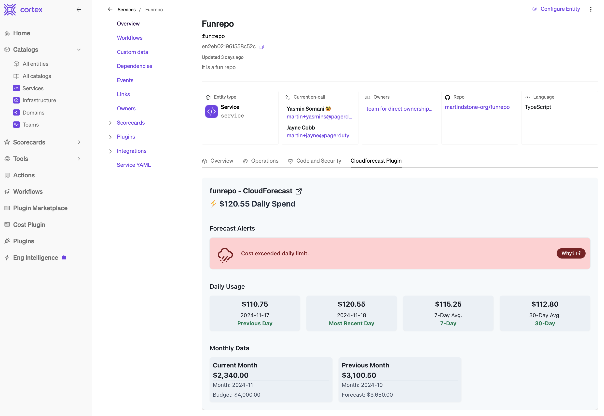
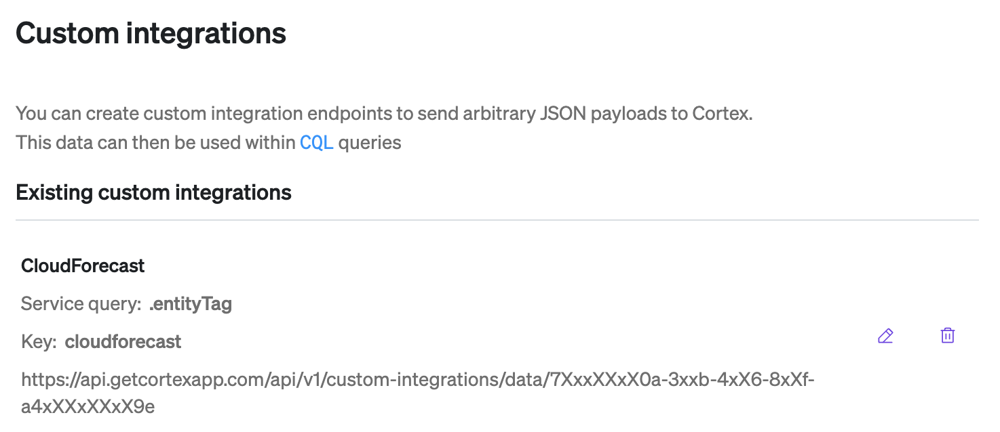
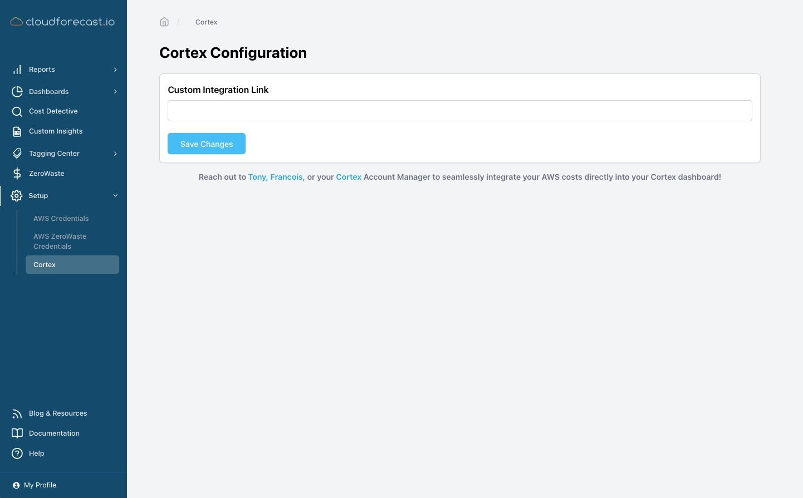
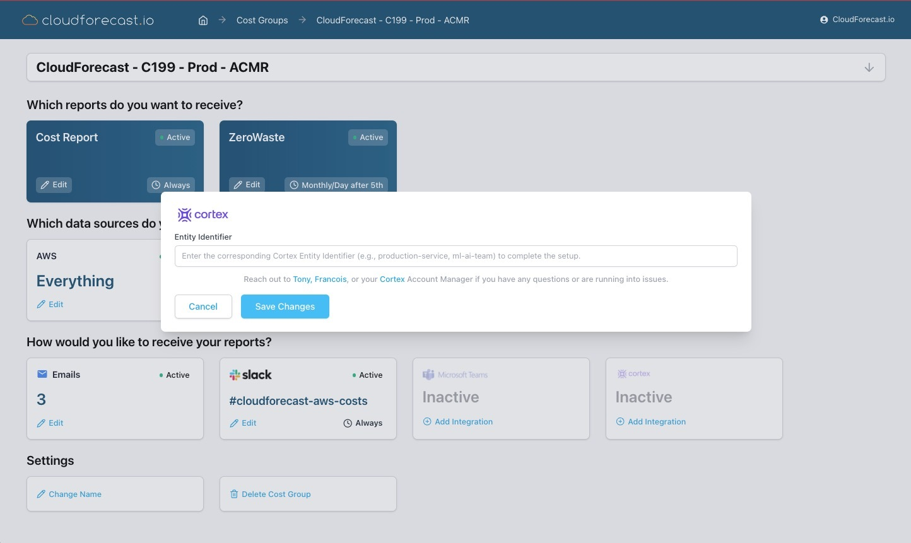

# CloudForecast Cortex Plugin

View CloudForecast data for your Cortex entities!

The CloudForecast Plugin for Cortex shows current highlights from CloudForecast reports related to your Cortex entities, and deeplinks back to the full report in CloudForecast. The data is ingested from CloudForecast webhooks using a Cortex Custom Integration.

## Setup

This plugin is available from the Cortex Plugin Marketplace. If you want to build the plugin yourself, follow the steps under **Build the Plugin** at the end of this document.

### Cortex Setup

This plugin uses a Custom Integration to take in webhooks from CloudForecast. To set up the Custom Integration in Cortex, follow these steps:

- Click on your user icon on the bottom left, then click Settings
- Click on Custom Integrations under the Integrations heading
- Under the New Custom Integration heading, fill in the three fields as below:
  - Name: `CloudForecast`
  - Entity Tag JQ: `.entityTag`
  - Key: `cloudforecast`
- Click Save.

Once you are done, your Custom Integration should look like this:

Copy the URL that's shown under the key. This will be the integration URL that you add to CloudForecast.

### CloudForecast Basic Setup

- In CloudForecast, click on Settings > Cortex
- Paste in the Custom Integration URL that you copied from the **Cortex Setup** above
- Click on Save Changes

### CloudForecast Report Setup

- Click on Reports > Cost Groups
- Click the Configure button on a Cost Group that you want to send to a Cortex entity
- Under "How would you like to receive your reports?" click on Cortex
- Type in the tag of the entity where you want this report to appear, and click on Save Changes
- Repeat these steps for all the Cost Groups you want to link to Cortex

_If you don't see the Cortex button in CloudForecast, reach out to your CloudForecast support team to enable it._

After the webhooks are delivered from Cortex, you will be able to see your CloudForecast data in your Entity Details page in Cortex, under the Plugins section!

### Build the Plugin (optional)

- Build the plugin:
- Make sure you have npm or yarn.
- In your terminal, in the `cloudforecast` directory, type `yarn` or `npm install` to install the dependencies; then type `npm run build` or `yarn build` to build the plugin.
- The compiled plugin will be created in `dist/ui.html`.
- In Plugins > All, click **Register Plugin**.
- Give the plugin a name, like CloudForecast. This is the name users will see in the plugin listing.
- Under **Plugin Context**, click on Add another context; choose Selection type: Include, and Entity types: service.
- This plugin does not work in the Global context. Turn off the switch labeled **Include in global context**.
- In The **Plugin code** section, upload the `dist/ui.html` file you just built.
- Click on **Save plugin**.

# Setting up your dev environment

SonarQube Issues Cortex Plugin is a [Cortex](https://www.cortex.io/) plugin. To see how to run the plugin inside of Cortex, see [our docs](https://docs.cortex.io/docs/plugins).

### Prerequisites

Developing and building this plugin requires either [yarn](https://classic.yarnpkg.com/lang/en/docs/install/) or [npm](https://docs.npmjs.com/downloading-and-installing-node-js-and-npm).

## Getting started

1. Run `yarn` or `npm install` to download all dependencies
2. Run `yarn build` or `npm run build` to compile the plugin code into `./dist/ui.html`
3. Upload `ui.html` into Cortex on a create or edit plugin page
4. Add or update the code and repeat steps 2-3 as necessary

### Notable scripts

The following commands come pre-configured in this repository. You can see all available commands in the `scripts` section of [package.json](./package.json). They can be run with npm via `npm run {script_name}` or with yarn via `yarn {script_name}`, depending on your package manager preference. For instance, the `build` command can be run with `npm run build` or `yarn build`.

- `build` - compiles the plugin. The compiled code root is `./src/index.tsx` (or as defined by [webpack.config.js](webpack.config.js)) and the output is generated into `dist/ui.html`.
- `test` - runs all tests defined in the repository using [jest](https://jestjs.io/)
- `lint` - runs lint and format checking on the repository using [prettier](https://prettier.io/) and [eslint](https://eslint.org/)
- `lintfix` - runs eslint in fix mode to fix any linting errors that can be fixed automatically
- `formatfix` - runs Prettier in fix mode to fix any formatting errors that can be fixed automatically

### Available React components

See available UI components via our [Storybook](https://cortexapps.github.io/plugin-core/).
