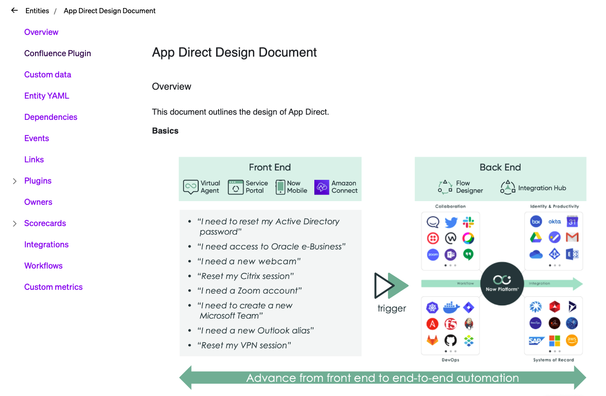

# Cortex Confluence Plugin

This plugin makes it possible to view Confluence assets alongside related entities in the service catalog, such as in this screenshot:



This is a [Cortex](https://www.cortex.io/) plugin. To see how to run the plugin inside of Cortex, see [our docs](https://docs.cortex.io/docs/plugins).

## Setup

### Find your Confluence instance URL

Your Confluence instance URL should look like `https://something.atlassian.net`. We will use this URL in the plugin's proxy and in the plugin's configuration entity.

### Set your Confluence credentials

If you are using username and password authentication, type them in to a text editor with a colon (`:`) between them. If you are using SSO, use an API token in place of the password. To create an API token in Confluence by clicking on Security > Create and manage API tokens > Create API token. Once you have your text in your text editor like `myusername@example.com:MySecretPassWordOrToken`, you need to base64 encode it. You can do this using an online tool like [this](https://www.base64encode.org). You will add the base64 encoded value to Cortex as a secret. Copy the base64 encoded value. In Cortex, click on Settings > Secrets > Add secret. In Secret name, type `confluence_secret`, paste the base64 encoded secret into Secret value, and click on Create secret.

### Set up a Plugin Proxy

After you've saved the secret, we will set up a proxy to use that secret to communicate with Confluence. In Cortex, click on Plugins > Proxies > Create Proxy. In Name, type `Confluence Proxy`. Click on Add URL, and put in your Confluence Instance URL, like `https://something.atlassian.net`. Click Save. Next, click on "Add header to https://something.atlassian.net". In the dialog box that appears, type `Authorization` in the Name field, and in the Value field, type `Basic {{{secrets.confluence_secret}}}`. Make sure you include the three curly braces, and make sure the secret name matches the secret you created above, with `secrets.` in front of it. Click Save, then click on the Create Proxy button.

### Associate the plugin with the plugin proxy

Create or edit your Confluence Plugin. In the dropdown under the Associated Proxy heading, choose the Confluence proxy you created above. Next, click Save plugin at the bottom of the page.

### Create a plugin configuration entity

- Consider creating a new entity type, so that any existing scorecards are not affected by ths configuration entity. In this example, we have created a new entity type called `plugin-configuration`
- Create a new entity with the tag `confluence-plugin-config`
- Set `x-cortex-definition.confluence-url` to the value of your Confluence Instance URL. For example, if my Confluence Instance URL was `https://martindstone.service-now.com`, my `confluence-plugin-config` entity would look like this:

```
openapi: 3.0.1
info:
  title: Confluence Plugin Config
  description: ""
  x-cortex-tag: confluence-plugin-config
  x-cortex-type: plugin-configuration
  x-cortex-definition:
    confluence-url: https://martindstone.service-now.com
```

### Adding Confluence content to entities

Entities can be associated with Confluence Page IDs by adding a PageID tag to the `x-cortex-confluence` object. In the Entity yaml for the entity to the Page ID that you'd like to view inside of Cortex, such as:

```
x-cortex-confluence:
  pageID: "123456"
```

You can do this for Custom Entities, as well as any Service entity.

### Done!

Now when you load the Confluence plugin on an entity that has a Confluence page ID in `x-cortex-confluence.pageID`, you should see the content of that page in Cortex!

## Building the plugin

1. Run `yarn` to download all dependencies
2. Run `yarn build` to compile the plugin code into `./dist/ui.html`
3. Upload `ui.html` into Cortex on a create or edit plugin page
