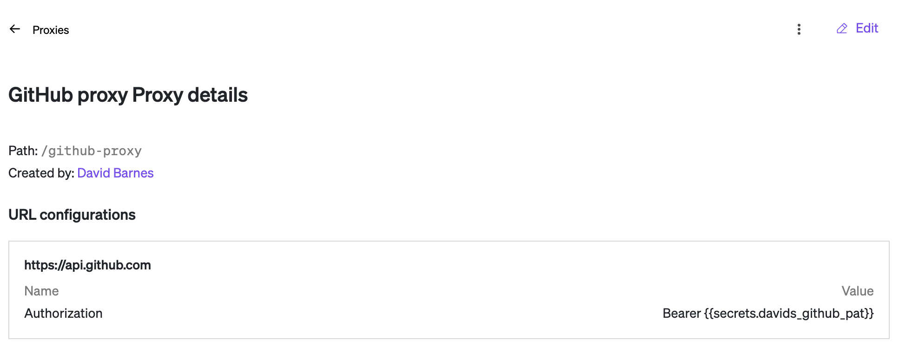
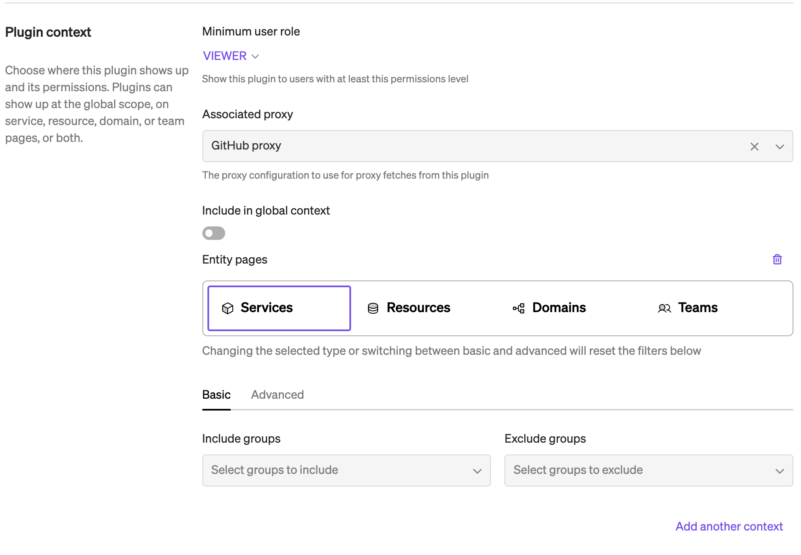

## GitHub Releases

This plugin provides a view of all Actions and Workflows for a GitHub repository. This allows easy access to the logs and configuration for each workflow within Cortex, as well as the ability to trigger workflows manually.

This plugin also serves as a showcase of the feasibility of re-using a Backstage plugin as a Cortex plugin. This plugin is a fork of the [GitHub Actions plugin](https://github.com/backstage/backstage/tree/master/plugins/github-actions) developed by The Backstage Authors.

### Configuration

For the plugin to function, it requires a GitHub token configured for usage with the proxy. Ensure that the proxy used by the plugin has `https://api.github.com` (or similar) configured to pass along the `Authorization: Bearer <token>`. We recommend using Cortex Secrets to inject the token into the proxy.



This plugin is intended to be used in the `ENTITY` context for any entity with a defined GitHub repository. An example git configuration snippet from a YAML file is below:

```yaml
x-cortex-git:
  github:
    repository: org/chat-service
```

See [Cortex entity GitHub configuration docs](https://docs.cortex.io/docs/reference/integrations/github) for more info.


