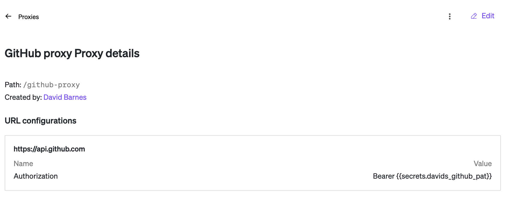
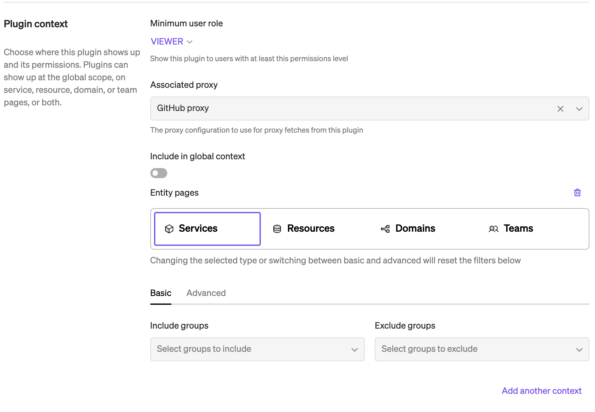

## GitHub Releases

This plugin provides a view of all releases for a GitHub repository. The main goal is to avoid the limitations of the GitHub Releases API and view, which does not allow sorting or filtering. By default, this plugin fetches all releases for a repository (in pages) and displays them in reverse chronological order, while hiding draft releases by default (controllable via a toggle).

### Configuration

For the plugin to function, it requires a GitHub token configured for usage with the proxy. Ensure that the proxy used by the plugin has `https://api.github.com` (or similar) configured to pass along the `Authorization: Bearer <token>`. We recommend using Cortex Secrets to inject the token into the proxy.



This plugin is intended to be used in the `ENTITY` context for any entity with a defined GitHub repository. An example git configuration snippet from a YAML file is below:

```yaml
x-cortex-git:
  github:
    repository: org/chat-service
```

See [Cortex entity GitHub configuration docs](https://docs.cortex.io/docs/reference/integrations/github) for more info.


