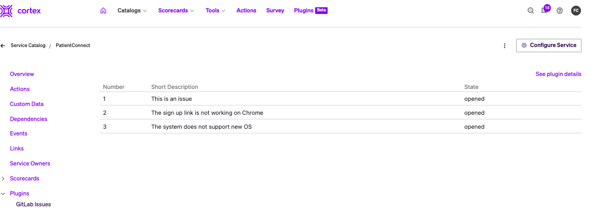
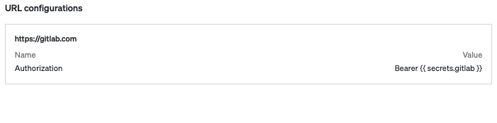
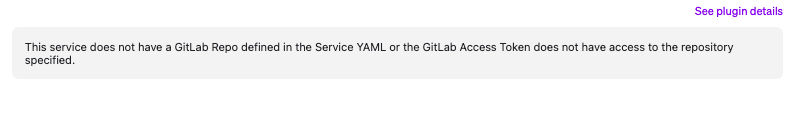

# GitLab Issues Cortex Plugin

View GitLab issues associated with your services!

<div align="center"></div>

The GitLab Issues plugin shows open GitLab issues associated to the GitLab repository specified in the entity's `cortex.yaml`. If the `cortex.yaml` has a `basepath` defined in its `x-cortex-git` configuration, it will query for issues filtering by a label that matches the tag of the entity.

## Setup

This plugin requires a proxy to GitLab. The API that the plugin uses is documented [here](https://docs.gitlab.com/ee/api/issues.html), which details the type of headers you need defined.

- Define a secret that contains your GitLab Access Token. To determine which type of token to use, check the [docs](https://docs.gitlab.com/ee/api/rest/index.html#authentication).
- Define a proxy that is pointed to your GitLab instance with the headers mentioned in the docs. Here is a screenshot of how your proxy may look like:
<div align="center"></div>

- Register the plugin.
  - This plan will not work on the Global context.
  - Select the entity that will have the GitLab repo in its `cortex.yaml`

## Connecting to an self hosted instance

This plugin will connect to GitLab's cloud instance out of the box. If you are self-hosting GitLab and need to direct the plugin to a different API endpoint, update the following section of the [Issues.tsx](src/components/Issues.tsx)file:

```Typescript
// Set your Gitlab url. Cloud is https://gitlab.com
const glURL = `https://gitlab.com/`;

```

## Troubleshooting

### Getting a message that "This service does not have a GitLab Repo defined"

If you get the following message:

<div align="center"></div>

This means that the plugin did not find a GitLab repository defined as described [here](https://docs.cortex.io/docs/reference/integrations/gitlab#catalog-descriptor).

# Setting up your dev environment

GitLab Issues Plugin is a [Cortex](https://www.cortex.io/) plugin. To see how to run the plugin inside of Cortex, see [our docs](https://docs.cortex.io/docs/plugins).

### Prerequisites

Developing and building this plugin requires either [yarn](https://classic.yarnpkg.com/lang/en/docs/install/) or [npm](https://docs.npmjs.com/downloading-and-installing-node-js-and-npm).

## Getting started

1. Run `yarn` or `npm install` to download all dependencies
2. Run `yarn build` or `npm run build` to compile the plugin code into `./dist/ui.html`
3. Upload `ui.html` into Cortex on a create or edit plugin page
4. Add or update the code and repeat steps 2-3 as necessary

### Notable scripts

The following commands come pre-configured in this repository. You can see all available commands in the `scripts` section of [package.json](./package.json). They can be run with npm via `npm run {script_name}` or with yarn via `yarn {script_name}`, depending on your package manager preference. For instance, the `build` command can be run with `npm run build` or `yarn build`.

- `build` - compiles the plugin. The compiled code root is `./src/index.tsx` (or as defined by [webpack.config.js](webpack.config.js)) and the output is generated into `dist/ui.html`.
- `test` - runs all tests defined in the repository using [jest](https://jestjs.io/)
- `lint` - runs lint and format checking on the repository using [prettier](https://prettier.io/) and [eslint](https://eslint.org/)
- `lintfix` - runs eslint in fix mode to fix any linting errors that can be fixed automatically
- `formatfix` - runs Prettier in fix mode to fix any formatting errors that can be fixed automatically

### Available React components

See available UI components via our [Storybook](https://cortexapps.github.io/plugin-core/).
