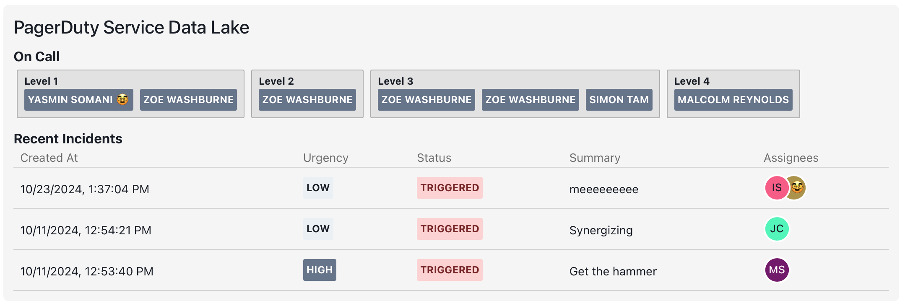
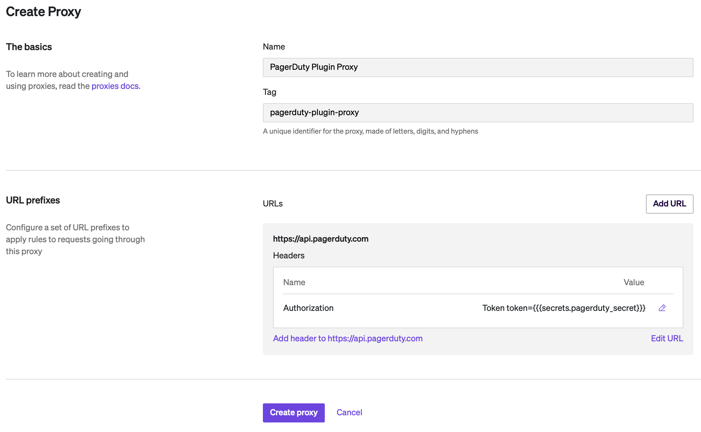
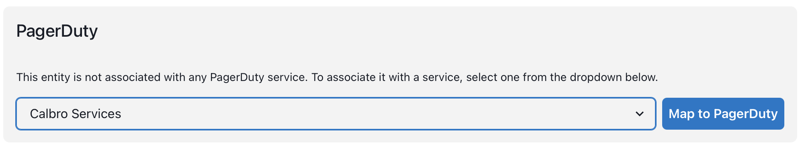

# SonarQube Issues Cortex Plugin

View PagerDuty incidents associated with your services!!

<div align="center"></div>

The PagerDuty Incidents plugin shows PagerDuty incidents associated with the PagerDuty service specified in the entity's `cortex.yaml`. If the `cortex.yaml` has a PagerDuty service defined in its `x-cortex-oncall` configuration, it will query for incidents in that service. For example:

```yaml
openapi: 3.0.1
info:
  title: funrepo
  description: Description of funrepo
  x-cortex-tag: funrepo
  x-cortex-type: service
  x-cortex-oncall:
    pagerduty:
      id: PXXXXXX
      type: SERVICE
```

## Setup

This plugin requires a proxy to PagerDuty. To set up:

- In PagerDuty, create an API Token by clicking on Integrations > API Access Keys > Create New API Key
- In Cortex, define a secret whose value is your new token. Name it `pagerduty_secret`.
- Create a plugin proxy in Cortex:

  - Navigate to Plugins, then click on the Proxies tab, then click on Create Proxy
  - Give the proxy a name, then click on Add URL
  - For the URL Prefix, type in `https://api.pagerduty.com`
  - Click on Add Header and add a header whose name is `Authorization` and whose value is `Token token={{{secrets.pagerduty_secret}}}` (include the curly braces!)

- Once you are done, the proxy should look like the below:

<div align="center"></div>

Now, you can build and add the plugin.

- Build the plugin:
  - Make sure you have npm/yarn
  - In your terminal, in the `pagerduty-incidents` directory, type `yarn` or `npm install` to install the dependencies
  - Type `npm run build` or `yarn build` to build the plugin
- The compiled plugin will be created in `dist/ui.html`
- In Plugins > All, click **Register Plugin**
- Give the plugin a name, like PagerDuty Incidents. This is the name users will see in the plugin listing.
- Under **Associated Proxy**, choose the proxy you just created.
- Under **Plugin Context**, click on Add another context; choose Selection type: Include, and Entity types: service.
- This plugin does not work in the Global context. Turn off the switch labeled **Include in global context**
- In The **Plugin code** section, upload the `dist/ui.html` file you just built.
- Click on **Save plugin**

Now, when you navigate to a Cortex entity that has a PagerDuty oncall associated with it, you should be able to click on Plugins > PagerDuty Incidents and see the PagerDuty incidents associated with the service that is linked to the entity.

If no PagerDuty oncall is set for the entity, you will see a service chooser that allows you to map the entity to a PagerDuty service.

<div align="center"></div>

If you don't want to see the PagerDuty plugin at all on entities that don't have a PagerDuty oncall, then you can adjust the plugin visibility via CQL to only show in entities where `x-cortex-oncall.pagerduty.type = SERVICE`.

# Setting up your dev environment

PagerDuty Incidents Plugin is a [Cortex](https://www.cortex.io/) plugin. To see how to run the plugin inside of Cortex, see [our docs](https://docs.cortex.io/docs/plugins).

### Prerequisites

Developing and building this plugin requires either [yarn](https://classic.yarnpkg.com/lang/en/docs/install/) or [npm](https://docs.npmjs.com/downloading-and-installing-node-js-and-npm).

## Getting started

1. Run `yarn` or `npm install` to download all dependencies
2. Run `yarn build` or `npm run build` to compile the plugin code into `./dist/ui.html`
3. Upload `ui.html` into Cortex on a create or edit plugin page
4. Add or update the code and repeat steps 2-3 as necessary

### Notable scripts

The following commands come pre-configured in this repository. You can see all available commands in the `scripts` section of [package.json](./package.json). They can be run with npm via `npm run {script_name}` or with yarn via `yarn {script_name}`, depending on your package manager preference. For instance, the `build` command can be run with `npm run build` or `yarn build`.

- `build` - compiles the plugin. The compiled code root is `./src/index.tsx` (or as defined by [webpack.config.js](webpack.config.js)) and the output is generated into `dist/ui.html`.
- `test` - runs all tests defined in the repository using [jest](https://jestjs.io/)
- `lint` - runs lint and format checking on the repository using [prettier](https://prettier.io/) and [eslint](https://eslint.org/)
- `lintfix` - runs eslint in fix mode to fix any linting errors that can be fixed automatically
- `formatfix` - runs Prettier in fix mode to fix any formatting errors that can be fixed automatically

### Available React components

See available UI components via our [Storybook](https://cortexapps.github.io/plugin-core/).
