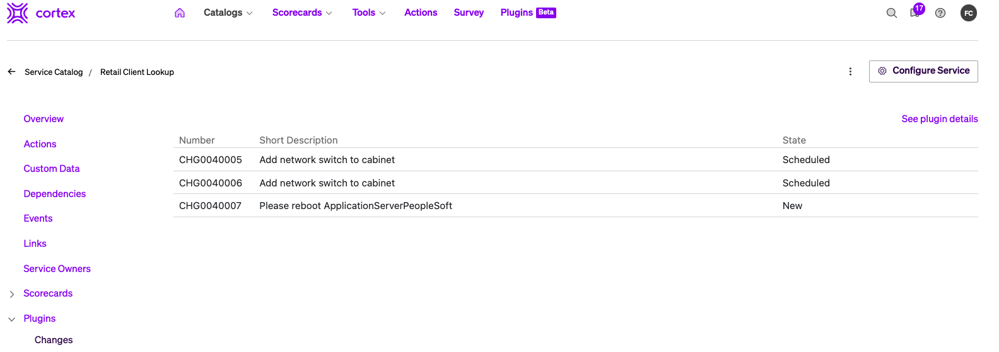
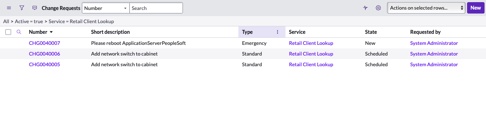

# ServiceNow Changes Plugin

View Change requests associated to a Cortex service!

The ServiceNow Changes plugin shows you open Change Requests that have been filed against a given service in Cortex.

The plugin uses the service name in Cortex to find a corresponding service with the same name in the CMDB. In this plugin, it is specifically looking at the `cmdb_ci_service` table, but could be modified to check a different table.

## Setup

This plugin will require a proxy to ServiceNow.
* Define a Secret that is a 64base encoding of 'username:password'. You can use a tool similar to this to convert this.
* Define a proxy that is pointed at your ServiceNow instance with the nescessary headers. For help figuring out which headers to use, refer to the REST API explorer in your servicenow instance. 

- Register the plugin.
  - This plan will not work on the Global context.
  - Select the entity that will have a corresponding entity in the `cmdb_ci_service` table.

# Setting up your dev environment

ServiceNow Changes Plugin is a [Cortex](https://www.cortex.io/) plugin. To see how to run the plugin inside of Cortex, see [our docs](https://docs.cortex.io/docs/plugins).

### Prerequisites

Developing and building this plugin requires either [yarn](https://classic.yarnpkg.com/lang/en/docs/install/) or [npm](https://docs.npmjs.com/downloading-and-installing-node-js-and-npm).

## Getting started

1. Run `yarn` or `npm install` to download all dependencies
2. Run `yarn build` or `npm run build` to compile the plugin code into `./dist/ui.html`
3. Upload `ui.html` into Cortex on a create or edit plugin page
4. Add or update the code and repeat steps 2-3 as necessary

### Notable scripts

The following commands come pre-configured in this repository. You can see all available commands in the `scripts` section of [package.json](./package.json). They can be run with npm via `npm run {script_name}` or with yarn via `yarn {script_name}`, depending on your package manager preference. For instance, the `build` command can be run with `npm run build` or `yarn build`.

- `build` - compiles the plugin. The compiled code root is `./src/index.tsx` (or as defined by [webpack.config.js](webpack.config.js)) and the output is generated into `dist/ui.html`.
- `test` - runs all tests defined in the repository using [jest](https://jestjs.io/)
- `lint` - runs lint and format checking on the repository using [prettier](https://prettier.io/) and [eslint](https://eslint.org/)
- `lintfix` - runs eslint in fix mode to fix any linting errors that can be fixed automatically
- `formatfix` - runs Prettier in fix mode to fix any formatting errors that can be fixed automatically

### Available React components

See available UI components via our [Storybook](https://cortexapps.github.io/plugin-core/).
