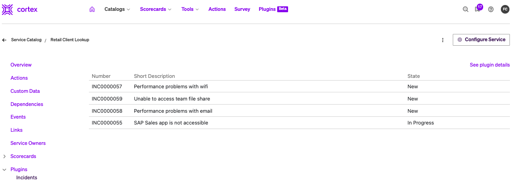
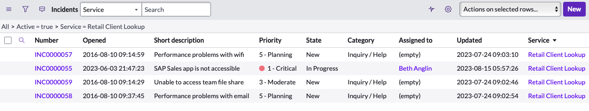
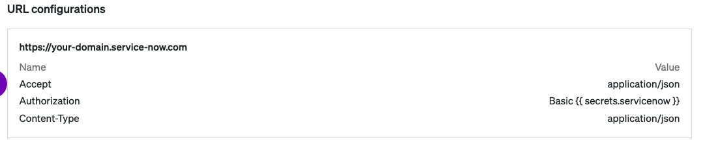
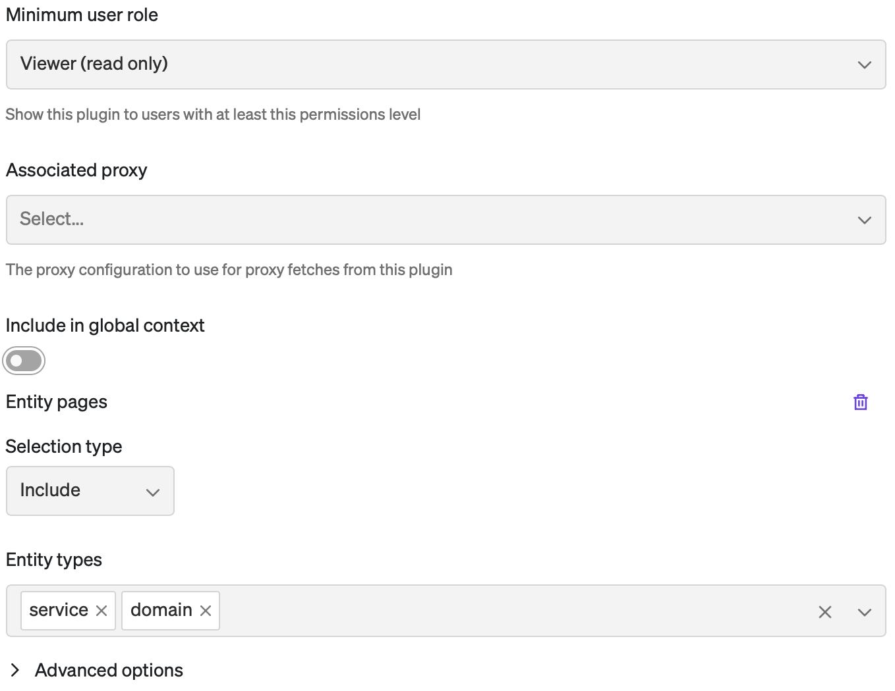

# ServiceNow Incidents Plugin

View ServiceNow incidents associated with a Cortex service!

<div align="center"></div>

The ServiceNow Incidents plugin shows you recent incidents that have been filed against a given service in Cortex. It does this by associating the Cortex entity with a CMDB CI, and searching the ServiceNow `incident` table for incidents whose `cmdb_ci`, `business_service`, or `affected_ci` match the associated CI. Here are the ways the plugin looks for the CI for a Cortex entity:

* If the Cortex entity is already mapped to a ServiceNow CMDB CI using the Cortex ServiceNow integration, the plugin will show incidents pertaining to that CI.
* If it's not mapped, the plugin uses the service name in Cortex to find a corresponding service with the same name in the CMDB by searching `cmdb_ci_service` for objects with the same name as the entity's tag or name.
* If you don't want to search, and want to configure a specific CI without mapping the entity to ServiceNow, you can set a custom data key `servicenow-sys_id` on the entity to the sys_id of the CI for which you want to show incidents when the plugin is displayed for that entity.

<div align="center"></div>

## Setup

To see how to run the plugin inside of Cortex, see [our docs](https://docs.cortex.io/docs/plugins). This plugin will require a proxy to ServiceNow.

### Proxy Setup

- Define a Secret that is a base64 encoding of `username:password`. You can use a tool similar to [this](https://www.debugbear.com/basic-auth-header-generator) to convert it.
- Define a proxy that is pointed at your ServiceNow instance with the nescessary headers. For help figuring out which headers to use, refer to the REST API explorer in your servicenow instance. Here is an example of what your proxy may look like:

<div align="center"></div>

### Plugin Registration

  - Create a Plugin and associate it with the proxy you created in the previous step
  - This Plugin will not work in the Global context.
  - Select the entity types that will have a corresponding CMDB CI. Below is what a configuration may look like. In this example the plugin will be available to both Services and Resources.
  <div align="center"></div>
  
  - Follow the directions under **Getting Started** below to build `ui.html` and upload it

### Set your ServiceNow instance URL

Your ServiceNow instance URL should look like `https://something.service-now.com`. It's the same URL you used to set up the proxy above. We also want to create a new entity to tell the plugin what ServiceNow URL to load:
  - Consider creating a new entity type, so that any existing scorecards are not affected by ths configuration entity. In this example, we have created a new entity type called `plugin-configuration`
  - Create a new entity with the tag `servicenow-plugin-config`
  - Set `x-cortex-definition.servicenow-url` to the value of your ServiceNow Instance URL. For example, if my ServiceNow Instance URL was `https://martindstone.service-now.com`, my `servicenow-plugin-config` entity would look like this:

```
openapi: 3.0.1
info:
  title: ServiceNow Plugin Config
  description: ""
  x-cortex-tag: servicenow-plugin-config
  x-cortex-type: plugin-configuration
  x-cortex-definition:
    servicenow-url: https://martindstone.service-now.com
```

Now when you load the plugin on an entity, you should see any ServiceNow incidents that were filed against that entity's CMDB CI.

## Setting up your dev environment

### Prerequisites

Developing and building this plugin requires either [yarn](https://classic.yarnpkg.com/lang/en/docs/install/) or [npm](https://docs.npmjs.com/downloading-and-installing-node-js-and-npm).

## Getting started

1. Run `yarn` or `npm install` to download all dependencies
2. Run `yarn build` or `npm run build` to compile the plugin code into `./dist/ui.html`
3. Upload `ui.html` into Cortex on a create or edit plugin page
4. Add or update the code and repeat steps 2-3 as necessary

### Notable scripts

The following commands come pre-configured in this repository. You can see all available commands in the `scripts` section of [package.json](./package.json). They can be run with npm via `npm run {script_name}` or with yarn via `yarn {script_name}`, depending on your package manager preference. For instance, the `build` command can be run with `npm run build` or `yarn build`.

- `build` - compiles the plugin. The compiled code root is `./src/index.tsx` (or as defined by [webpack.config.js](webpack.config.js)) and the output is generated into `dist/ui.html`.
- `test` - runs all tests defined in the repository using [jest](https://jestjs.io/)
- `lint` - runs lint and format checking on the repository using [prettier](https://prettier.io/) and [eslint](https://eslint.org/)
- `lintfix` - runs eslint in fix mode to fix any linting errors that can be fixed automatically
- `formatfix` - runs Prettier in fix mode to fix any formatting errors that can be fixed automatically

### Available React components

See available UI components via our [Storybook](https://cortexapps.github.io/plugin-core/).
