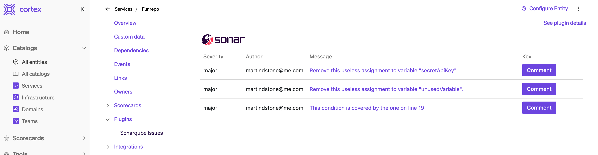
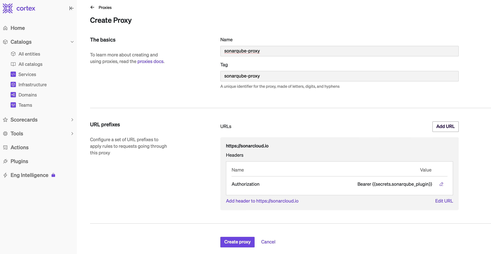
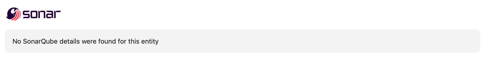

# SonarQube Issues Cortex Plugin

View SonarQube Issues associated with your services!!

<div align="center"></div>

The SonarQube Issues plugin shows open SonarQube issues associated with the SonarQube project specified in the entity's `cortex.yaml`. If the `cortex.yaml` has a SonarQube Project defined in its `x-cortex-static-analysis` configuration, it will query for issues pertaining to that project. For example:

```yaml
openapi: 3.0.1
info:
  title: Funrepo
  description: it is a fun repo
  x-cortex-git:
    github:
      alias: cortex
      repository: martindstone-org/funrepo
  x-cortex-tag: funrepo
  x-cortex-type: service
  x-cortex-static-analysis:
    sonarqube:
      project: martindstone-org_funrepo
```

## Setup

This plugin requires a proxy to SonarQube. To set up:

- Create a token in SonarQube by clicking on your profile > My Account > Security
- In Cortex, define a secret whose value is your new token. Name it `sonarqube_plugin`.
- Create a proxy:

  - Navigate to Plugins, then click on the Proxies tab, then click on Create Proxy
  - Give the proxy a name, then click on Add URL
  - For the URL Prefix, type in the base URL of your SonarQube instance. Default for cloud is `https://sonarcloud.io`. **This URL prefix should be exactly the same as the value of the baseURL variable in [SonarqubeIssues.tsx](src/components/SonarqubeIssues.tsx) - If you are self-hosting SonarQube, you will have to put your own base URL in both places!**
  - Click on Add Header and add a header whose name is `Authorization` and whose value is `Bearer {{secrets.sonarqube_plugin}}` (include the curly braces!)

- Once you are done, the proxy should look like the below:

<div align="center"></div>

Now, you can build and add the plugin.

- Build the plugin:
  - Make sure you have npm/yarn, and make sure you have put in your correct SonarQube Base URL in the baseURL variable in [SonarqubeIssues.tsx](src/components/SonarqubeIssues.tsx)
  - In your terminal, in the `sonarqube-issues` directory, type `yarn` or `npm install` to install the dependencies; then type `npm run build` or `yarn build` to build the plugin
- The compiled plugin will be created in `dist/ui.html`
- In Plugins > All, click **Register Plugin**
- Give the plugin a name, like SonarQube Issues. This is the name users will see in the plugin listing.
- Under **Associated Proxy**, choose the proxy you just created.
- Under **Plugin Context**, click on Add another context; choose Selection type: Include, and Entity types: service.
- This plugin does not work in the Global context. Turn off the switch labeled **Include in global context**
- In The **Plugin code** section, upload the `dist/ui.html` file you just built.
- Click on **Save plugin**

Now, when you navigate to a Service that has a SonarQube associated with it, you should be able to click on Plugins > SonarQube Issues and see the SonarQube Issues associated with the project that is linked to the service.

**Note: This plugin will connect to SonarQube's cloud instance out of the box.** If you are self-hosting SonarQube and need to direct the plugin to a different API endpoint, update the following section of the [SonarqubeIssues.tsx](src/components/SonarqubeIssues.tsx) file:

```ts
// Set your SonarQube url. Cloud is https://sonarcloud.io
const baseURL = "https://sonarcloud.io";
```

## Troubleshooting

### Getting a message that "No SonarQube details were found for this entity"

If you get the following message:

<div align="center"></div>

This means that the plugin did not find a SonarQube project defined as described [here](https://docs.cortex.io/docs/reference/integrations/sonarqube#entity-descriptor).

# Setting up your dev environment

SonarQube Issues Cortex Plugin is a [Cortex](https://www.cortex.io/) plugin. To see how to run the plugin inside of Cortex, see [our docs](https://docs.cortex.io/docs/plugins).

### Prerequisites

Developing and building this plugin requires either [yarn](https://classic.yarnpkg.com/lang/en/docs/install/) or [npm](https://docs.npmjs.com/downloading-and-installing-node-js-and-npm).

## Getting started

1. Run `yarn` or `npm install` to download all dependencies
2. Run `yarn build` or `npm run build` to compile the plugin code into `./dist/ui.html`
3. Upload `ui.html` into Cortex on a create or edit plugin page
4. Add or update the code and repeat steps 2-3 as necessary

### Notable scripts

The following commands come pre-configured in this repository. You can see all available commands in the `scripts` section of [package.json](./package.json). They can be run with npm via `npm run {script_name}` or with yarn via `yarn {script_name}`, depending on your package manager preference. For instance, the `build` command can be run with `npm run build` or `yarn build`.

- `build` - compiles the plugin. The compiled code root is `./src/index.tsx` (or as defined by [webpack.config.js](webpack.config.js)) and the output is generated into `dist/ui.html`.
- `test` - runs all tests defined in the repository using [jest](https://jestjs.io/)
- `lint` - runs lint and format checking on the repository using [prettier](https://prettier.io/) and [eslint](https://eslint.org/)
- `lintfix` - runs eslint in fix mode to fix any linting errors that can be fixed automatically
- `formatfix` - runs Prettier in fix mode to fix any formatting errors that can be fixed automatically

### Available React components

See available UI components via our [Storybook](https://cortexapps.github.io/plugin-core/).
