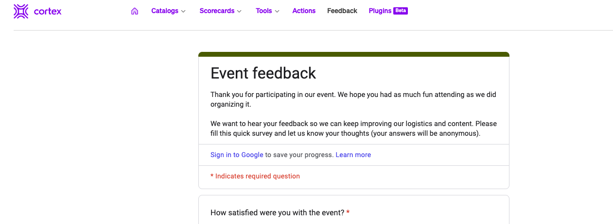
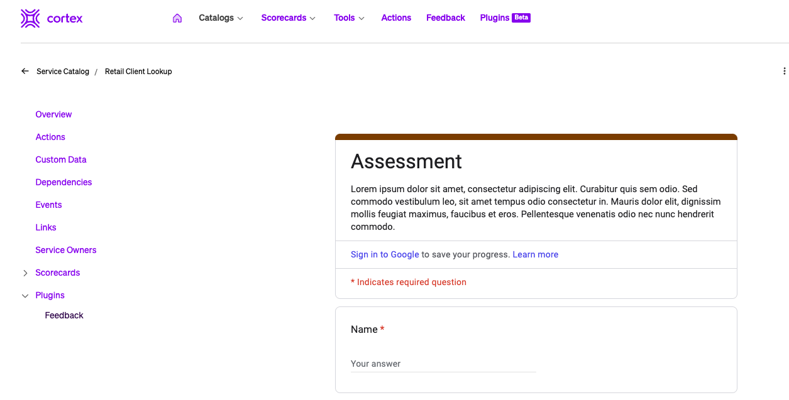

# Survey Plugin

Collect feedback from the team within Cortex!

This plugin allows you to embed a survey form in Cortex to collect feedback from users. The screenshots and tests were done with Google Forms but other Forms like Microsoft Forms should work as well.

## Overview

The plugin has a Google Forms address hard coded. This is the Google Form that is shown by default and when viewed in the Global context.



Update this with the survey form you would like to display by default in the Global context.

The plugin will also check for a specific custom data key if viewed from the Entity context. If the key is there, it will render the form specified in that custom data key.



## Setup

This plugin requires no secrets or proxy set.
Register a new plugin and set the following fields:

- name (*i.e., Feedback*)
- Include it in global context
- Add another context for the entity types that could have a custom data key, like a service, domain, etc...
- Add the ui.html file compiled from this plugin

### How to set the default survey url

The default survey url is hard coded in the `./src/components/App.tsx` as follows:

```typescript
import React from "react";
import { Loader, usePluginContext } from "@cortexapps/plugin-core/components";
import "../baseStyles.css";
import { PluginContextLocation } from "@cortexapps/plugin-core";

// Update this with your default/Global Survey Form
const defaultSurvey = "https://my-great-survey.com/form1"

```
### How to add specific survey url to an entity

If the plugin is running within an entity, it will look for a key named **survey** in the custom data associated to this entity. If it finds they key, it will use its value as the survey url.

The survey url for an entity can be set via the [Custom Data API](https://docs.cortex.io/docs/api/add-custom-data-for-entity) or by adding the following section to the service yaml:

```yaml
x-cortex-custom-metadata:
    survey: "https://my-great-survey.com/form2"
```
Please refer to our [documentation](https://docs.cortex.io/docs/reference/basics/custom-data) for more details on using custom data.

# Setting up your Dev environment

Survey Plugin is a [Cortex](https://www.cortex.io/) plugin. To see how to run the plugin inside of Cortex, see [our docs](https://docs.cortex.io/docs/plugins).

### Prerequisites

Developing and building this plugin requires either [yarn](https://classic.yarnpkg.com/lang/en/docs/install/) or [npm](https://docs.npmjs.com/downloading-and-installing-node-js-and-npm).

## Getting started

1. Run `yarn` or `npm install` to download all dependencies
2. Run `yarn build` or `npm run build` to compile the plugin code into `./dist/ui.html`
3. Upload `ui.html` into Cortex on a create or edit plugin page
4. Add or update the code and repeat steps 2-3 as necessary

### Notable scripts

The following commands come pre-configured in this repository. You can see all available commands in the `scripts` section of [package.json](./package.json). They can be run with npm via `npm run {script_name}` or with yarn via `yarn {script_name}`, depending on your package manager preference. For instance, the `build` command can be run with `npm run build` or `yarn build`.

- `build` - compiles the plugin. The compiled code root is `./src/index.tsx` (or as defined by [webpack.config.js](webpack.config.js)) and the output is generated into `dist/ui.html`.
- `test` - runs all tests defined in the repository using [jest](https://jestjs.io/)
- `lint` - runs lint and format checking on the repository using [prettier](https://prettier.io/) and [eslint](https://eslint.org/)
- `lintfix` - runs eslint in fix mode to fix any linting errors that can be fixed automatically
- `formatfix` - runs Prettier in fix mode to fix any formatting errors that can be fixed automatically

### Available React components

See available UI components via our [Storybook](https://cortexapps.github.io/plugin-core/).
